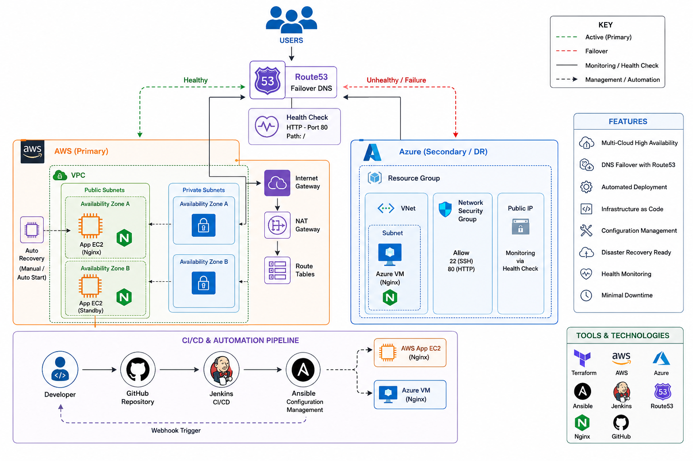
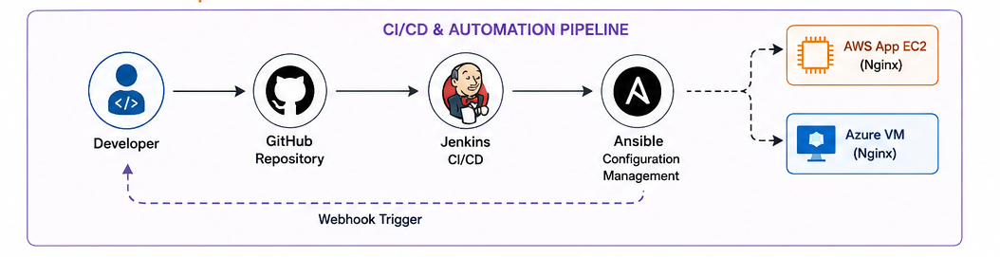
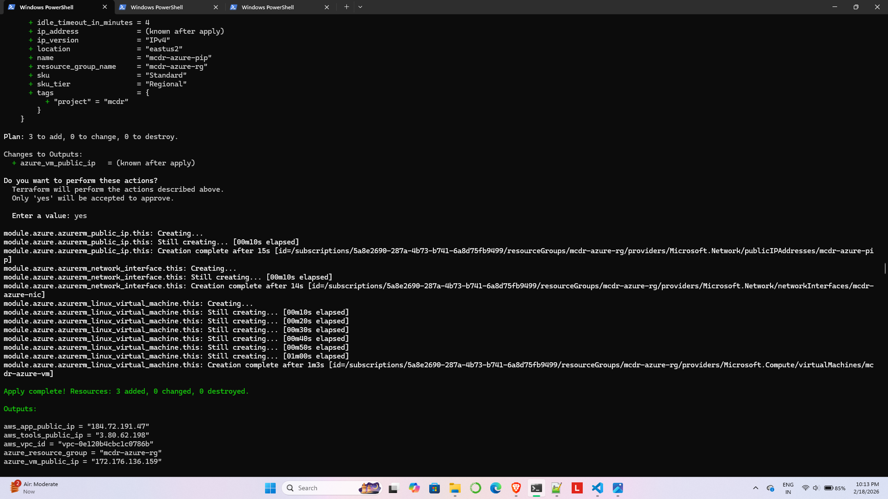
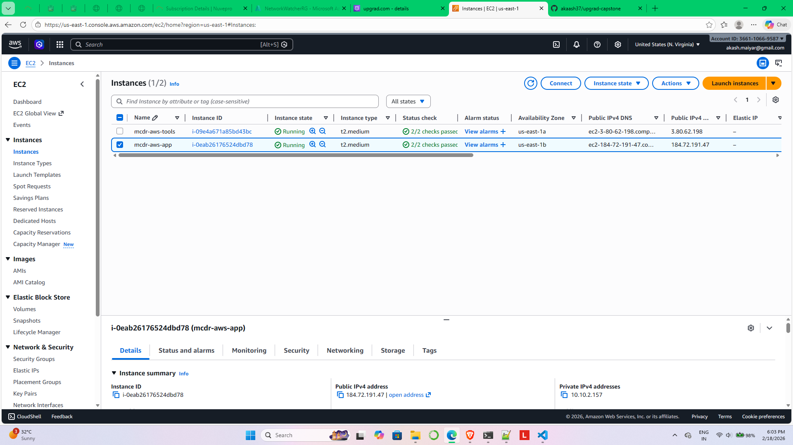
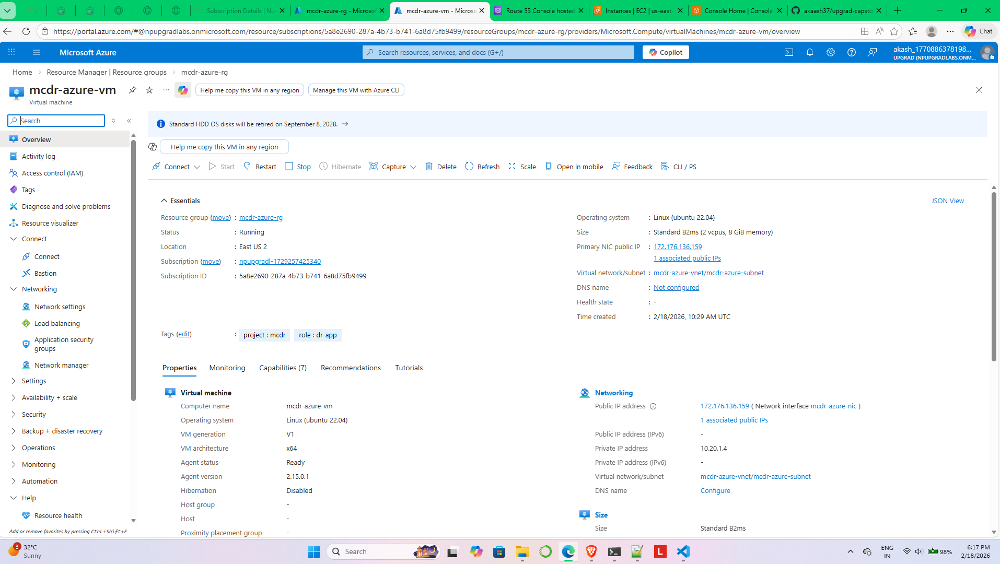
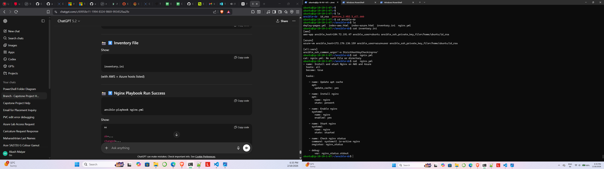
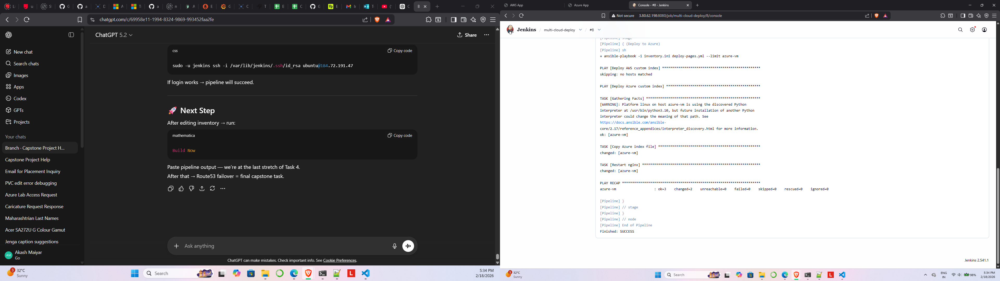

# 🌍 Multi-Cloud Disaster Recovery System (AWS + Azure)

A production-style Multi-Cloud Disaster Recovery (DR) project built using AWS, Azure, Terraform, Ansible, Jenkins, and Route53.

This project demonstrates automated infrastructure provisioning, configuration management, CI/CD deployment, and DNS-based disaster recovery failover between AWS and Azure.

---

# 📌 Project Overview

This architecture uses:

- AWS as the Primary Cloud
- Azure as the Disaster Recovery (DR) Cloud
- Terraform for Infrastructure as Code (IaC)
- Ansible for Configuration Management
- Jenkins for CI/CD Automation
- Route53 for DNS Failover Routing

The system automatically redirects traffic to Azure when AWS becomes unavailable.

---

# 🏗️ Architecture Diagram



---

# 🔄 Workflow Diagram



---

# ⚙️ Technologies Used

| Technology | Purpose |
|---|---|
| AWS | Primary Infrastructure |
| Azure | Disaster Recovery Infrastructure |
| Terraform | Infrastructure Provisioning |
| Ansible | Configuration Management |
| Jenkins | CI/CD Pipeline |
| Route53 | DNS Failover |
| GitHub | Source Control |
| Nginx | Web Server |

---

# ☁️ AWS Infrastructure

## Region
- us-east-1

## Components

### Networking
- Custom VPC
- 2 Public Subnets
- 2 Private Subnets
- Internet Gateway
- NAT Gateway
- Route Tables

### Security
- Security Groups
- SSH Access
- HTTP Access

### Compute
- AWS Tools EC2
- AWS App EC2

---

# ☁️ Azure Infrastructure

## Region
- East US 2

## Components

- Resource Group
- Virtual Network (VNet)
- Subnet
- Network Security Group
- Ubuntu Virtual Machine
- Public IP

---

# 📂 Repository Structure

```text
multi-cloud-dr/
│
├── terraform/
│   ├── main.tf
│   ├── providers.tf
│   ├── variables.tf
│   ├── outputs.tf
│   ├── terraform.tfvars.example
│   │
│   └── modules/
│       ├── aws/
│       └── azure/
│
├── ansible/
│   ├── inventory.ini
│   ├── nginx.yml
│   ├── deploy-pages.yml
│   │
│   └── files/
│       ├── index-aws.html
│       └── index-azure.html
│
├── jenkins/
│   └── Jenkinsfile
│
├── docs/
│   ├── architecture-diagram.png
│   ├── flow-diagram.png
│   │
│   └── screenshots/
│
├── .gitignore
└── README.md
```

---

# 🚀 Infrastructure Provisioning using Terraform

Terraform was used to provision infrastructure on AWS and Azure.

## Terraform Commands

```bash
terraform init
terraform validate
terraform plan
terraform apply
```

---

# 🔧 Configuration Management using Ansible

Ansible was installed on the AWS Tools Machine to configure both AWS and Azure servers remotely.

## Features

- Nginx Installation
- Service Management
- Automated Deployment
- Multi-Cloud Configuration

## Playbooks

| Playbook | Purpose |
|---|---|
| nginx.yml | Install and configure Nginx |
| deploy-pages.yml | Deploy custom HTML pages |

---

# 🌐 Application Deployment

Custom web pages were deployed using Ansible.

## AWS Page

```text
Welcome to AWS
Multi-Cloud DR Capstone Project
```

## Azure Page

```text
Welcome to Azure
Multi-Cloud DR Capstone Project
```

---

# 🔁 Jenkins CI/CD Pipeline

Jenkins automates deployment to AWS and Azure.

## Pipeline Stages

1. Clone GitHub Repository
2. Deploy to AWS
3. Deploy to Azure

## Jenkinsfile Location

```text
jenkins/Jenkinsfile
```

---

# 🌍 Route53 DNS Failover

Route53 Failover Routing was configured for Disaster Recovery.

## Domain

```text
mcdr-demo.upgrad.com
```

## Failover Configuration

| Type | Destination |
|---|---|
| Primary | AWS App EC2 |
| Secondary | Azure VM |

## Health Check

- Protocol: HTTP
- Port: 80
- Path: /

If AWS becomes unhealthy, Route53 automatically redirects traffic to Azure.

---

# 🧪 Disaster Recovery Testing

## Normal State

```text
User → Route53 → AWS
```

Users see:

```text
Welcome to AWS
```

---

## Failure Simulation

### Steps

1. Stop AWS App EC2
2. Route53 Health Check Fails
3. Traffic Redirects to Azure

Users then see:

```text
Welcome to Azure
```

---

# 📸 Screenshots

## Terraform Apply



---

## AWS Infrastructure



---

## Azure Infrastructure



---

## Ansible Deployment



---

## Jenkins Pipeline Success



---

## Route53 Failover


---

# 🔐 Security Features

- SSH-based Authentication
- Security Groups
- Network Security Groups
- Controlled Inbound Access
- Infrastructure Isolation using VPC/VNet

---

# ✅ Key Features

- Multi-Cloud Deployment
- Infrastructure as Code
- Automated Configuration
- Automated CI/CD
- DNS Failover
- Disaster Recovery
- Health Monitoring
- High Availability
- Minimal Downtime

---

# 📈 Project Outcome

Successfully designed and implemented a production-style Multi-Cloud Disaster Recovery solution with:

- AWS + Azure Integration
- Infrastructure Automation
- Configuration Automation
- CI/CD Automation
- Route53 Health-Based Failover
- Disaster Recovery Testing

---

# 🎯 Learning Outcomes

Through this project, the following skills were demonstrated:

- Terraform Modular Architecture
- AWS Networking
- Azure Networking
- Ansible Automation
- Jenkins Pipelines
- Route53 Failover Routing
- Multi-Cloud Architecture Design
- Disaster Recovery Concepts
- CI/CD Best Practices

---

# 👨‍💻 Author

Akash Maiyar

---

# ⭐ Future Improvements

- Auto Scaling Groups
- Load Balancers
- Kubernetes Deployment
- Monitoring with Prometheus & Grafana
- HTTPS with SSL Certificates
- Terraform Remote Backend
- GitHub Webhooks
- Blue-Green Deployment

---

# 📜 License

This project is for educational and portfolio purposes.
